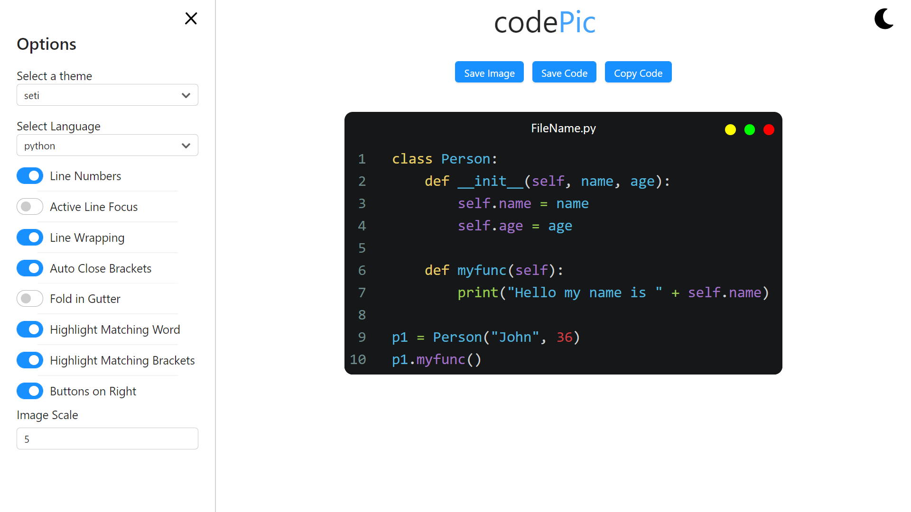

## Hey, I'm Shreyas 👋🏼

 

- 🔭 I’m currently working on Python, Flask Projects
- 📖 Learning Flutter framework
- 💬 Ask me about anything
- 📫 Find me at : [Telegram](https://telegram.dog/ShreyasDalwale)
- 💻 Below are some of my Projects
 
<table align="center">
  <tr>
    <th colspan="2">Projects</th>
<!--     <th>-</th> -->
  </tr>
  
  <tr>
    <td width=300px><h1><a href="http://codePic.cf">codePic</a></h1> It exports code snippets to themed images.</td>
    <td> </td>
   </tr> 
<!--   <tr>
    <td width=300px><h1><a href="http://codePic.cf">codePic</a></h1> It exports code snippets to themed images.</td>
    <td> </td>
   </tr>  -->
  
</table>

<!--  -->
<!--  -->

